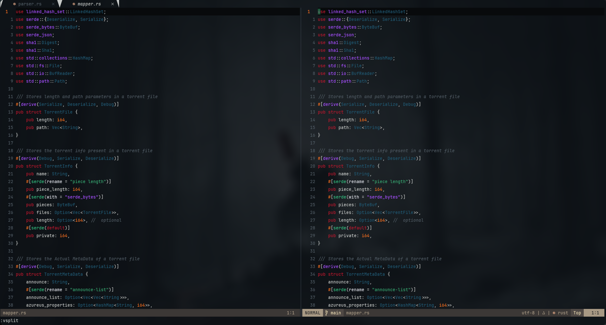
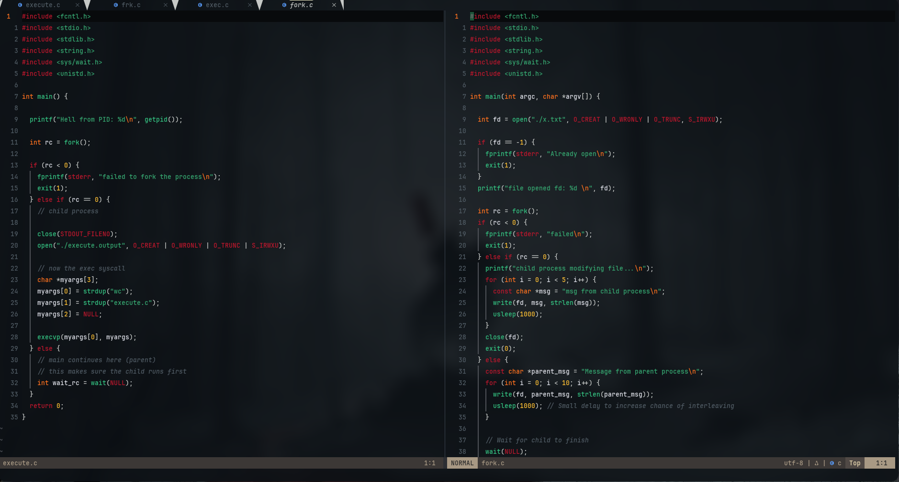
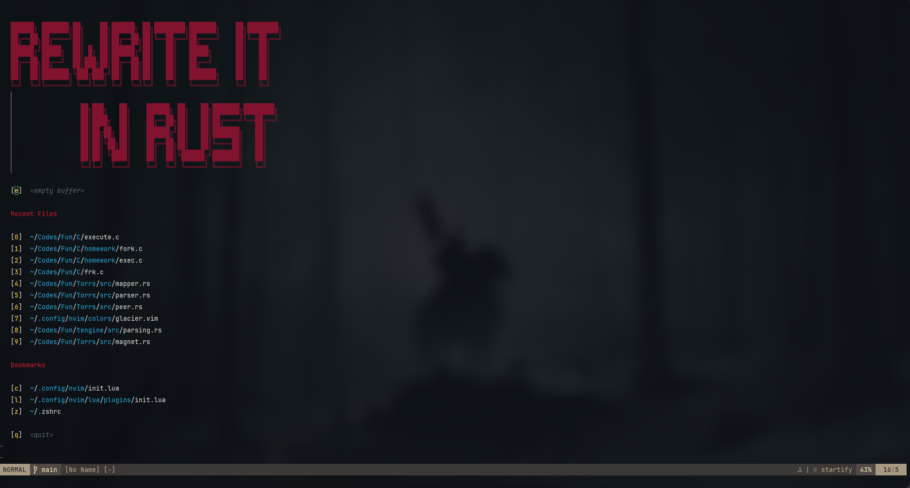

# Glacier.vim

A dark colorscheme for Vim/Neovim based on Ghostty's Glacier theme. This elegant, cool-toned theme provides comfortable contrast and carefully selected colors optimized for code readability.



## Features

- Dark, cool-toned color palette inspired by Ghostty's Glacier
- Carefully crafted syntax highlighting for enhanced code readability
- Support for LSP diagnostics highlighting
- Git diff and Git gutter integration
- Telescope and file tree integration
- True color terminal support
- Works in both Vim and Neovim

## Requirements

- Vim >= 8.0 or Neovim >= 0.5.0
- Terminal with true color support (`termguicolors`)

## Installation

### Using a Plugin Manager

#### Vim-Plug
```vim
Plug 'soroushsrd/glacier.vim'
```

#### Packer (Neovim)
```lua
use 'soroushsrd/glacier.vim'
```

#### Lazy.nvim (Neovim)
```lua
{
  'soroushsrd/glacier.vim',
  lazy = false,
  priority = 1000,
}
```

### Manual Installation

#### Vim
```bash
mkdir -p ~/.vim/colors
cp glacier.vim ~/.vim/colors/
```

#### Neovim
```bash
mkdir -p ~/.config/nvim/colors
cp glacier.vim ~/.config/nvim/colors/
```

## Usage

### Vim (in .vimrc)
```vim
set termguicolors
colorscheme glacier
```

### Neovim (in init.vim)
```vim
set termguicolors
colorscheme glacier
```

### Neovim with Lua (in init.lua)
```lua
vim.opt.termguicolors = true
vim.cmd('colorscheme glacier')
-- Or in newer Neovim versions:
-- vim.cmd.colorscheme('glacier')
```

## Recommended Plugin Integrations

Glacier.vim works well with these plugins:
- Git integration: [vim-gitgutter](https://github.com/airblade/vim-gitgutter) or [gitsigns.nvim](https://github.com/lewis6991/gitsigns.nvim)
- Fuzzy finder: [telescope.nvim](https://github.com/nvim-telescope/telescope.nvim)
- LSP support: Native Neovim LSP
- Syntax highlighting: [nvim-treesitter](https://github.com/nvim-treesitter/nvim-treesitter)

## Customization

You can customize certain aspects of the theme by adding configuration to your Vim/Neovim setup before loading the colorscheme.

## Screenshots


*C code highlighting*


*Rust syntax highlighting*


*Dashboard and split windows*

## License

MIT

## Credits

- Inspired by [Ghostty's Glacier](https://github.com/mitchellh/ghostty) terminal theme
- Created with ❤️ by [Your Name]
